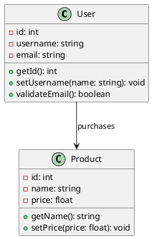

# 🚀 Model-to-Code Generator

Convert UML class diagrams to production-ready source code in multiple programming languages. No server required - runs entirely in your browser!

[](https://yourusername.github.io/model-to-code/)
[](https://github.com/yourusername/model-to-code/actions)
[](https://opensource.org/licenses/MIT)

A powerful Python application that converts UML class diagrams into source code in multiple programming languages. Transform your visual models into working code instantly!

## 🌟 Features

### 📝 Multiple Input Formats
- **Simple Text**: Easy-to-write text format for quick prototyping
- **PlantUML**: Industry-standard UML syntax
- **YAML**: Structured configuration format

### 🔧 Multiple Output Languages
- **Python**: Complete classes with type hints, properties, and documentation
- **Java**: Full Java classes with proper encapsulation and JavaDoc
- **TypeScript**: Modern TypeScript with interfaces and type safety

### 🎯 Rich Model Support
- Class attributes with visibility modifiers
- Methods with parameters and return types
- Inheritance and interface implementation
- Relationships between classes
- Abstract classes and interfaces
- Static and final modifiers

### 🖥️ Multiple Interfaces
- **Command Line**: Batch processing and automation
- **Web Interface**: Interactive browser-based tool
- **Programmatic API**: Integration into other tools

## 🌐 Try It Now

**[🔗 Open Live Demo](https://yourusername.github.io/model-to-code/)**

No installation required! The demo runs entirely in your browser.

## 🚀 Quick Start

### Option 1: Use Live Demo (Recommended)
Simply visit **[the live demo](https://yourusername.github.io/model-to-code/)** and start generating code immediately!

### Option 2: Run Locally

```bash
git clone https://github.com/yourusername/model-to-code.git
cd model-to-code
python3 -m venv venv
source venv/bin/activate  # On Windows: venv\Scripts\activate
pip install -r requirements.txt
```

### Option 3: Standalone HTML
Download `standalone_ui.html` and open it directly in your browser - no server needed!

### Command Line Usage

```bash
# Generate Python code from simple text
python main.py -i examples/simple_model.txt -l python -o output/

# Generate Java code from PlantUML
python main.py -i examples/plantuml_model.puml -f plantuml -l java -o output/

# Generate TypeScript from YAML
python main.py -i examples/yaml_model.yaml -f yaml -l typescript -o output/

# Generate sample code
python main.py --sample -l python -o examples/

# Validate model only
python main.py -i model.txt --validate-only

# Start web interface
python main.py --web
```

### Web Interface

Start the web interface for an interactive experience:

```bash
python main.py --web
```

Then open http://localhost:5000 in your browser.

## 📖 Model Formats

### Simple Text Format

Easy-to-write format perfect for quick modeling:

```
User:
  id: int
  username: string
  email: string
  getId()
  setUsername(name: string)
  validateEmail()

Product:
  id: int
  name: string
  price: float
  getName()
  setPrice(price: float)
```

### PlantUML Format

Standard UML syntax with full feature support:



### YAML Format

Structured format with detailed metadata:

```yaml
name: "E-commerce System"
description: "Basic e-commerce domain model"

classes:
  - name: User
    package: entities
    attributes:
      - name: id
        type: int
        visibility: private
      - name: username
        type: string
        visibility: private
    methods:
      - name: getId
        return_type: int
        visibility: public
      - name: setUsername
        visibility: public
        parameters:
          - name: username
            type: string

relationships:
  - from: User
    to: Product
    type: association
    label: "purchases"
```

## 🏗️ Generated Code Examples

### Python Output

```python
"""
User class
Generated from UML model
"""

from typing import List, Dict, Any, Optional
from datetime import datetime


class User:
    """User account management"""
    
    def __init__(self, id: int, username: str, email: str):
        """Initialize the class instance"""
        self._id = id
        self._username = username
        self._email = email
    
    def get_id(self) -> int:
        """Get Id method"""
        return self._id
    
    def set_username(self, username: str):
        """Set Username method"""
        self._username = username
    
    @property
    def id(self) -> int:
        """Get id"""
        return self._id
    
    @id.setter
    def id(self, value: int):
        """Set id"""
        self._id = value
```

### Java Output

```java
package entities;

/**
 * User class
 * Generated from UML model
 */
public class User {
    private int id;
    private String username;
    private String email;

    /**
     * Default constructor for User
     */
    public User() {
    }

    /**
     * Parameterized constructor for User
     * @param id the id value
     * @param username the username value  
     * @param email the email value
     */
    public User(int id, String username, String email) {
        this.id = id;
        this.username = username;
        this.email = email;
    }

    /**
     * Get Id method
     * @return int
     */
    public int getId() {
        return this.id;
    }

    /**
     * Set Username method
     * @param username the username parameter
     */
    public void setUsername(String username) {
        this.username = username;
    }
}
```

### TypeScript Output

```typescript
/**
 * User class
 * Generated from UML model
 */
export class User {
  private id: number;
  private username: string;
  private email: string;

  /**
   * Creates an instance of User
   * @param id - id parameter
   * @param username - username parameter
   * @param email - email parameter
   */
  constructor(id: number, username: string, email: string) {
    this.id = id;
    this.username = username;
    this.email = email;
  }

  /**
   * Get Id method
   * @returns number
   */
  public getId(): number {
    return this.id;
  }

  /**
   * Set Username method
   * @param username - username parameter
   */
  public setUsername(username: string): void {
    this.username = username;
  }
}
```

## 🛠️ Advanced Features

### Relationships

Support for various UML relationships:
- **Inheritance**: `extends`, `implements`
- **Association**: Simple references between classes
- **Composition**: Strong ownership relationships
- **Aggregation**: Weak ownership relationships

### Code Generation Options

- **Type Safety**: Full type annotations and hints
- **Documentation**: Auto-generated comments and documentation
- **Design Patterns**: Common patterns like getters/setters, builders
- **Package Structure**: Proper module/package organization

### Validation

Built-in model validation:
- Syntax checking
- Relationship validation  
- Type consistency
- Circular dependency detection

## 🎯 Use Cases

### 🏢 Enterprise Development
- Rapid prototyping from business requirements
- Code generation for microservices
- API model generation
- Database entity creation

### 🎓 Education
- Teaching OOP concepts
- UML to code demonstration
- Design pattern examples
- Software architecture visualization

### 🚀 Rapid Development
- MVP creation
- Proof of concept development
- API scaffolding
- Test data model generation

## 📁 Project Structure

```
model-to-code/
├── src/
│   ├── models/         # Data models and class definitions
│   ├── parsers/        # Input format parsers
│   ├── generators/     # Code generators for each language
│   └── web/           # Web interface
├── examples/          # Sample model files
├── tests/            # Unit tests
├── main.py           # CLI application
└── README.md         # This file
```

## 🤝 Contributing

Contributions are welcome! Here are ways to help:

1. **Add new output languages** (C#, Go, Rust, etc.)
2. **Improve parsers** (better PlantUML support, new formats)
3. **Enhance generators** (more design patterns, better code quality)
4. **Add features** (database schema generation, API documentation)
5. **Write tests** (unit tests, integration tests)

## 📄 License

This project is licensed under the MIT License - see the LICENSE file for details.

## 🙏 Acknowledgments

- PlantUML for UML syntax inspiration
- The Python community for excellent libraries
- Contributors and users who provide feedback

## 🔮 Roadmap

- [ ] Database schema generation
- [ ] REST API documentation generation  
- [ ] GraphQL schema generation
- [ ] Docker containerization
- [ ] VS Code extension
- [ ] More output languages (C#, Go, Rust)
- [ ] Advanced relationship handling
- [ ] Custom template support
- [ ] Integration with modeling tools

---

**Ready to transform your models into code?** Get started with `python main.py --sample` and see the magic happen! ✨